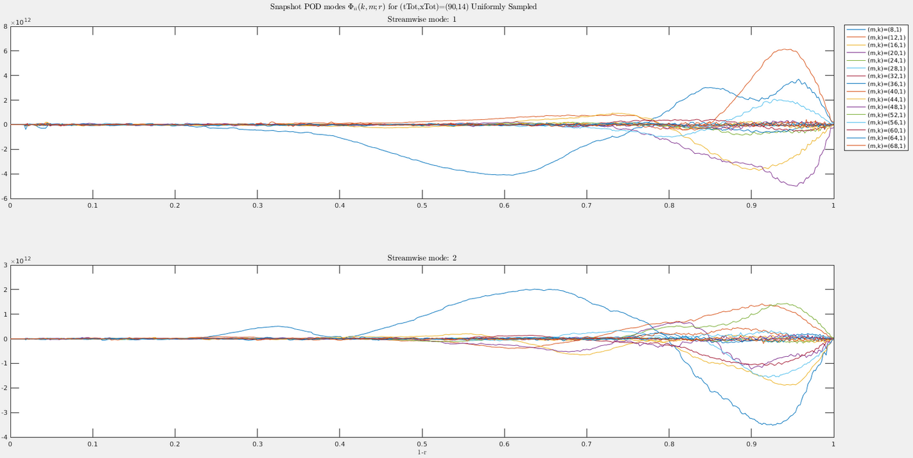
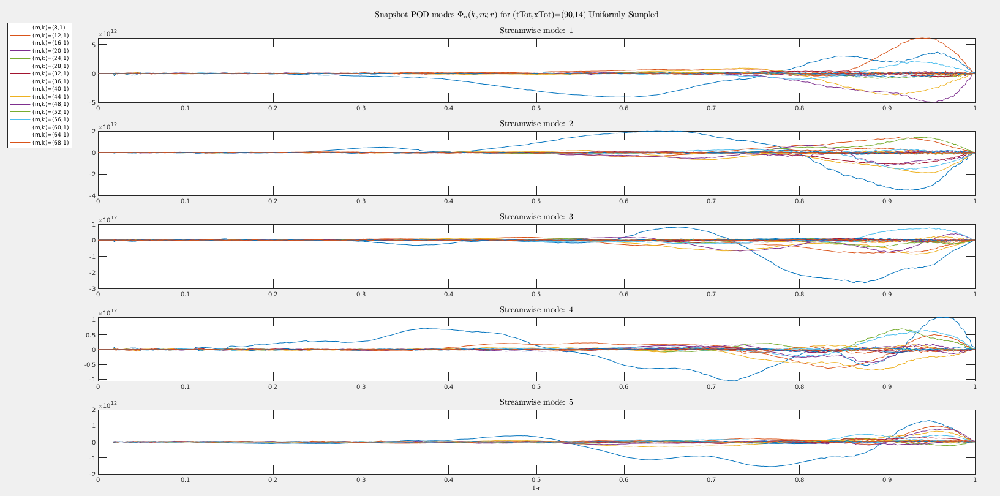

# Table of Contents

1.  Phit90x14uniformlySpaced.mat
2.  shows snapshot pod with uniformly spaced timesteps & crosssection data
    -   azimuthalSet=[1,4,8,12,16,20,24,28,32,36,40,44,48,52,56,60,64,68];
    -   csSet = 1     6    11    16    21    26    31    36    41    46    51    56    61    66
    -   timeSet = [1    11    21    31    41    51    61    71    81    91   101   111   121   131   141   151   161   171   181   191 201   211   221   231   241   251   261   271   281   291   301   311   321   331   341   351   361   371   381   391 401   411   421   431   441   451   461   471   481   491   501   511   521   531   541   551   561   571   581   591 601   611   621   631   641   651   661   671   681   691   701   711   721   731   741   751   761   771   781   791 801   811   821   831   841   851   861   871   881   891]
3.  this run has amplitude mistake

