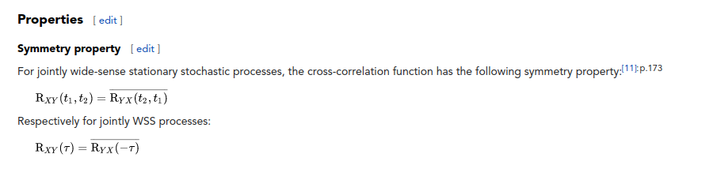

# To do:

-   implement spectral

-   [ ] implement pod

# Proper Orthogonal Decompositon (Snapshot POD) Code

# Description

Follows the paper by [Citrini and George 2000](https://www.cambridge.org/core/journals/journal-of-fluid-mechanics/article/abs/reconstruction-of-the-global-velocity-field-in-the-axisymmetric-mixing-layer-utilizing-the-proper-orthogonal-decomposition/68BAA266FC58F299B2D9DA612C8F4A6C) ,  which is used by eg, [Hellstrom and Smits 2017](https://royalsocietypublishing.org/doi/full/10.1098/rsta.2016.0086) and [Ganapathisubramani, Hellstrom, and Smits 2015](https://www.cambridge.org/core/journals/journal-of-fluid-mechanics/article/abs/evolution-of-largescale-motions-in-turbulent-pipe-flow/CB2FF14595A6E552DF8A554FE489CBE9).

# Part 1: Spectral Analysis Procedure

The process of taking azimuthal and streamwise FFT is described in this section. The motivation for taking in both directions is described in eg (source).

# Part 2: POD

## Method (A), Snapshot POD Procedure following Citrini

According to source (cite), the POD equation in pipe coordinates may be written as,

$$\int_{r^{\prime}} \boldsymbol{S}\left(m ; r, r^{\prime}\right) \Phi_{n}\left(m ; r^{\prime}\right) \mathrm{d} r^{\prime}=\lambda_{n}(m) \Phi_{n}(m ; r)$$

where $n$ represents the POD mode number, $\Phi_{n}$ are the eigenfunctions with the corresponding eigenvalues $\lambda_{n}$, and $m$ represents the azimuthally decomposed mode number. Here, $r$ from the polar integration is absorbed into the eigenfunctions and the cross-correlation tensor.

Define the time-averaged cross-correlation tensor as

$$\mathbf{S}\left(m ; r, r^{\prime}\right)=\lim_{\tau \rightarrow \infty} \frac{1}{\tau} \int_{0}^{\tau} r^{1 / 2} \boldsymbol{u}(m ; r, t) \boldsymbol{u}^{*}\left(m ; r^{\prime}, t\right) r^{1 / 2} \mathrm{~d} t$$

Next write the projection coefficient $\alpha$ for the radial geometry as,

$$\alpha_{n}(m ; t)=\int_{r} \boldsymbol{u}(m ; r, t) r^{1 / 2} \Phi_{n}^{*}(m ; r) \mathrm{d} r$$

Then, we may rewrite the eigenvalue problem, which we will implement in the code

$$\lim_{\tau \rightarrow \infty} \frac{1}{\tau} \int_{0}^{\tau}\left(r^{1 / 2} \boldsymbol{u}(m ; r, t), r^{1 / 2} \boldsymbol{u}\left(m ; r, t^{\prime}\right)\right) \alpha_{n}(m ; t) \mathrm{d} t^{\prime}=\lambda_{n}(m) \alpha_{n}(m ; t) \hspace{0.2in}\text{(Equation A)}$$
 The resulting solution $\alpha_n$ for $n\in \{1,\ldots , N\}$ is found from the above. From that, we may directly find the eigenfunctions $\Phi_n$, which are given by,

$$\lim_{\tau \rightarrow \infty} \frac{1}{\tau} \int_{0}^{\tau} r^{1 / 2} \boldsymbol{u}(m ; r, t) \alpha_{n}^{*}(m ; t) \mathrm{d} t=\Phi_{n}(m ; r) \lambda^{n}(m) \hspace{0.2in}\text{(Equation B)}$$

by solving for $\Phi_n$.

## Method (B): Following Hellstrom Smits 2017

Write the correlation tensor R as, following Smits 2017 comment under equation 2.4,

$$\mathbf{R}\left(k ; m ; t, t^{\prime}\right)=\int_{r} \mathbf{u}(k ; m ; r, t) \mathbf{u}^{*}\left(k ; m ; r, t^{\prime}\right) r \mathrm{~d} r$$.

Solve the eigenvalue problem,

$$\lim_{\tau \rightarrow \infty} \frac{1}{\tau} \int_{0}^{\tau} \mathbf{R}\left(k ; m ; t, t^{\prime}\right) \alpha^{(n)}\left(k ; m ; t^{\prime}\right) \mathrm{d} t^{\prime}=\lambda^{(n)}(k ; m) \alpha^{(n)}(k ; m ; t)$$

Finally solve for the eigenfunction $\Phi_n$ ,

$$\lim_{\tau \rightarrow \infty} \frac{1}{\tau} \int_{0}^{\tau} \mathbf{u}_{\mathrm{T}}(k ; m ; r, t) \alpha^{(n)^{*}}(k ; m ; t) \mathrm{d} t=\Phi_{\mathrm{T}}^{(n)}(k ; m ; r) \lambda^{(n)}(k ; m).$$

## Resolution: Prefer Method (B) over Method (A)

We can apply method (B) directly &#x2014; by Fredholm theory, in order for there exists a solution to the eigenvalue problem, the integral operator needs to be symmetric. But that is already symmetric in $t$.

## Preliminary Plot of Time Correlation (no POD yet):

-   Graph of the Correlation in time of the streamwise velocity fluctuation $R(t,t';m;k)$ ..

$.")

# Meeting Question,

-   the xcorr() returns a $2*totalTimesteps -1$ function. We need a
    matrix for the eigenvalue problem. That matrix is actually symmetric.
    To form that we follow [this wikipedia article on cross-correlation](https://en.wikipedia.org/wiki/Cross-correlation) and since the process is stationary, it is symmetric:
    
    
    
    eg, we identify the xcorr in time function with the matrix,

$$S(t,t') = \begin{bmatrix} S(0) & S(1) & S(2) \\ S(1) & S(0) & S(1)   \\ S(2) & S(1) & S(0) \end{bmatrix}$$

# So whats the question?

-   We must integrate the correlation with $t'$ according to the equation above.
    -   But if we integrate before finding eigenpairs, then its no longer a ntimestep x ntimestep matrix &#x2026;
    -   So when to integrate (use trapz() is confusing because I&rsquo;m not sure about what variable to operate on &#x2026;

# Sources:

1.  Duggleby and Paul
2.  Citrini and George
3.  Smits 2014

