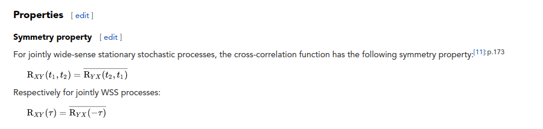

# Changes &lt;2022-05-31 Tue&gt;

-   Need to change
    $$\alpha_{n}(m ; t)=\int_{r} \boldsymbol{u}(m ; r, t) r^{1 / 2} \Phi_{n}^{*}(m ; r) \mathrm{d} r$$

so $u(x)$  instead of $u(r)$ ! That is because

$$\lim _{\tau \rightarrow \infty} \frac{1}{\tau} \int_{0}^{\tau} \mathbf{u}_{\mathrm{T}}(k ; m ; r, t) \alpha^{(n)^{*}}(k ; m ; t) \mathrm{d} t=\Phi_{\mathrm{T}}^{(n)}(k ; m ; r) \lambda^{(n)}(k ; m)$$

with $\left[u_{x}, u_{r}, u_{\theta}, p\right]^{\mathrm{T}}$, and we need to plot $\Phi_x$, not $\Phi_r$.

# Changes &lt;2022-05-30 Mon&gt;

-   reasonable amplitudes with xcorr symmetric matrix case after $r\in [0,0.5]$.
-   wrote function averaging the crosssecions
-   copying data to fast drive \`/mnt/interest/\`
-   **To do**: Need to fix **correlate operation**: fix for each $t_i$, where $1\leq i \leq n$, and correlate each timestep one at a time.
    -   Do this on Tuesday.
    -   currently, alpha is not $n$-indexed.
    -   spot exactly where aliasing occurs. I think this is happening at the fft-x step (?)

# Changes &lt;2022-05-28 Sat&gt;

-   working on xcor symmetric matrix
-   Back up this Readme

## Proper Orthogonal Decompositon (Snapshot POD) Code

## Description

Follows the paper by [Citrini and George 2000](https://www.cambridge.org/core/journals/journal-of-fluid-mechanics/article/abs/reconstruction-of-the-global-velocity-field-in-the-axisymmetric-mixing-layer-utilizing-the-proper-orthogonal-decomposition/68BAA266FC58F299B2D9DA612C8F4A6C) ,  which is used by eg, [Hellstrom and Smits 2017](https://royalsocietypublishing.org/doi/full/10.1098/rsta.2016.0086) and [Ganapathisubramani, Hellstrom, and Smits 2015](https://www.cambridge.org/core/journals/journal-of-fluid-mechanics/article/abs/evolution-of-largescale-motions-in-turbulent-pipe-flow/CB2FF14595A6E552DF8A554FE489CBE9).

### Part 1: Spectral Analysis Procedure

The process of taking azimuthal and streamwise FFT is described in this section. The motivation for taking in both directions is described in eg (source).

### Part 2: POD

-   Method (A), Snapshot POD Procedure following Citrini
    
    According to source (cite), the POD equation in pipe coordinates may be written as,

$$\int_{r^{\prime}} \boldsymbol{S}\left(m ; r, r^{\prime}\right) \Phi_{n}\left(m ; r^{\prime}\right) \mathrm{d} r^{\prime}=\lambda_{n}(m) \Phi_{n}(m ; r)$$

where $n$ represents the POD mode number, $\Phi_{n}$ are the eigenfunctions with the corresponding eigenvalues $\lambda_{n}$, and $m$ represents the azimuthally decomposed mode number. Here, $r$ from the polar integration is absorbed into the eigenfunctions and the cross-correlation tensor.

Define the time-averaged cross-correlation tensor as

$$\mathbf{S}\left(m ; r, r^{\prime}\right)=\lim_{\tau \rightarrow \infty} \frac{1}{\tau} \int_{0}^{\tau} r^{1 / 2} \boldsymbol{u}(m ; r, t) \boldsymbol{u}^{*}\left(m ; r^{\prime}, t\right) r^{1 / 2} \mathrm{~d} t$$

Next write the projection coefficient $\alpha$ for the radial geometry as,

$$\alpha_{n}(m ; t)=\int_{r} \boldsymbol{u}(m ; r, t) r^{1 / 2} \Phi_{n}^{*}(m ; r) \mathrm{d} r$$

Then, we may rewrite the eigenvalue problem, which we will implement in the code

$$\lim_{\tau \rightarrow \infty} \frac{1}{\tau} \int_{0}^{\tau}\left(r^{1 / 2} \boldsymbol{u}(m ; r, t), r^{1 / 2} \boldsymbol{u}\left(m ; r, t^{\prime}\right)\right) \alpha_{n}(m ; t) \mathrm{d} t^{\prime}=\lambda_{n}(m) \alpha_{n}(m ; t) \hspace{0.2in}\text{(Equation A)}$$
 The resulting solution $\alpha_n$ for $n\in \{1,\ldots , N\}$ is found from the above. From that, we may directly find the eigenfunctions $\Phi_n$, which are given by,

$$\lim_{\tau \rightarrow \infty} \frac{1}{\tau} \int_{0}^{\tau} r^{1 / 2} \boldsymbol{u}(m ; r, t) \alpha_{n}^{*}(m ; t) \mathrm{d} t=\Phi_{n}(m ; r) \lambda^{n}(m) \hspace{0.2in}\text{(Equation B)}$$

by solving for $\Phi_n$.

-   Method (B): Following Hellstrom Smits 2017

Write the correlation tensor R as, following Smits 2017 comment under equation 2.4,

$$\mathbf{R}\left(k ; m ; t, t^{\prime}\right)=\int_{r} \mathbf{u}(k ; m ; r, t) \mathbf{u}^{*}\left(k ; m ; r, t^{\prime}\right) r \mathrm{~d} r$$.

Solve the eigenvalue problem,

$$\lim_{\tau \rightarrow \infty} \frac{1}{\tau} \int_{0}^{\tau} \mathbf{R}\left(k ; m ; t, t^{\prime}\right) \alpha^{(n)}\left(k ; m ; t^{\prime}\right) \mathrm{d} t^{\prime}=\lambda^{(n)}(k ; m) \alpha^{(n)}(k ; m ; t)$$

Finally solve for the eigenfunction $\Phi_n$ ,

$$\lim_{\tau \rightarrow \infty} \frac{1}{\tau} \int_{0}^{\tau} \mathbf{u}_{\mathrm{T}}(k ; m ; r, t) \alpha^{(n)^{*}}(k ; m ; t) \mathrm{d} t=\Phi_{\mathrm{T}}^{(n)}(k ; m ; r) \lambda^{(n)}(k ; m).$$

-   Resolution: Prefer Method (B) over Method (A)

We can apply method (B) directly &#x2014; by Fredholm theory, in order for there exists a solution to the eigenvalue problem, the integral operator needs to be symmetric. But that is already symmetric in $t$.

-   Preliminary Plot of Time Correlation (no POD yet):

-   Graph of the Correlation in time of the streamwise velocity fluctuation $R(t,t';m;k)$ ..

$.")

-   Meeting Question,

-   the xcorr() returns a $\left(2*\text{totalTimesteps} -1\right)$ function. We need a
    **matrix** (not array) for the eigenvalue problem. So how to organize that vector in a matrix. First, that matrix is actually symmetric. Also,
    to form that we follow [this wikipedia article on cross-correlation](https://en.wikipedia.org/wiki/Cross-correlation) and since the process is stationary, it is symmetric:
    
    
    
    -   **Minimal 3x3 example:**, we identify the xcorr in time function with the matrix,

$S(t,t') = \begin{bmatrix} S(0) & S(1) & S(2)\\\ S(1) & S(0) & S(1)\\\ S(2) & S(1) & S(0)\end{bmatrix}$

where eg $S(0)$ is the 0-lag, $S(1)$ is the 1 lag, etc.

-   So whats the question?
-   We must integrate the correlation with $t'$ according to the equation above.
    
    $$\lim_{\tau \rightarrow \infty} \frac{1}{\tau} \int_{0}^{\tau} \mathbf{R}\left(k ; m ; t, t^{\prime}\right) \alpha^{(n)}\left(k ; m ; t^{\prime}\right) \mathrm{d} t^{\prime}=\lambda^{(n)}(k ; m) \alpha^{(n)}(k ; m ; t)$$
    
    -   But if we integrate before finding eigenpairs, then its no longer a ntimestep x ntimestep matrix &#x2026;
    -   So when to integrate (use trapz() is confusing because I&rsquo;m not sure about what variable to operate on &#x2026;
-   Sources:
-   Duggleby and Paul
-   Citrini and George
-   Smits 2014
-   [Time series Analysis by Schumway, Chapter 5](https://github.com/nickpoison/tsa4)
    1.  Cite this for the correlation function conversion into symmetric matrix form.

-   make correlation matrix option to:
    1.  Option A: use either direct multiplication,
    2.  Option B: xcorr (which is then formed into a symmetric matrix with 0 lag on the diagonal)
    3.  Option C: use corrcoef(y,ctranspose()). This gives 1 along the diagonal.

# Changes &lt;2022-05-27 Fri&gt;

1.  finish u save/import. ran pod.
    -   r is incorrect.  change to real radius $[0,R]= 0.5$ and $dr$ presumably $0.5/540$. Exact value is dr = 9.276438000000004e-04

# Changes &lt;2022-05-26 Thu&gt;

1.  Almost done with POD. Refactored: so no moore xcorr with AzimuthalModes5.m
2.  started direct correlation hellstrom 2017. need to refactor the save/load of velocity signal in $t,m,k,r$. Really annoying part! because:
3.  Needed to refactor the velocity signal load/save mechanism. 
    1.  saving happens in timebloc, but also crosssection. But:
    2.  I need to then later load in crosssection and then time bloc, and then save that.
    3.  So that&rsquo;s juggling three competing tasks!

Note that (2) has mistakes, so needs fixing. 

# Changes &lt;2022-05-25 Wed&gt;

1.  finish most of pod, but has mistakes with using xcorr. Some nonsense with snapshot that didn&rsquo;t occur with classical pod.

# Changes &lt;2022-05-24 Tue&gt;

1.  refactored lot of stuff, lot of reading done today (helped with eg Tuesday-Thursday work).

# DONE Changes &lt;2022-05-22 Sun&gt;

-   1. adding snapshot pod.
-   2. change temporal dim from ntimesteps to 2\*ntimesteps -1, after xcorr application in time direction

# Changes &lt;2022-05-21 Sat&gt;

1.  spectral analysis following Smits2017. fft(x,theta) and correlate in time, then average radially (weighted).

# Changes  &lt;2022-05-20 Fri&gt;

1.  start of branch using Citrini&rsquo;s paper for snapshot pod
2.  remove correlation step from fft procedure
3.  implement equations (3.4)-(3.5) from Citrini and George 2000.

